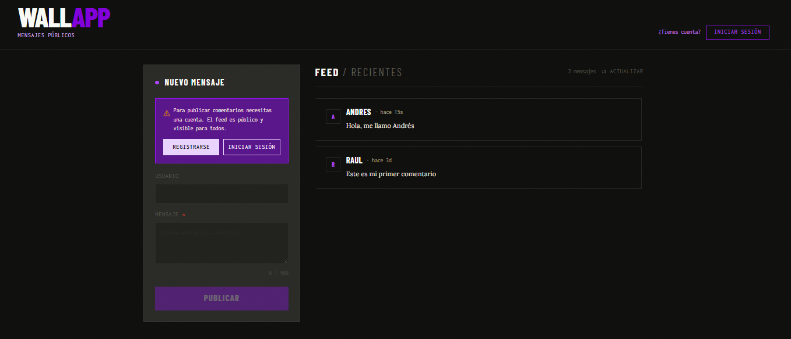
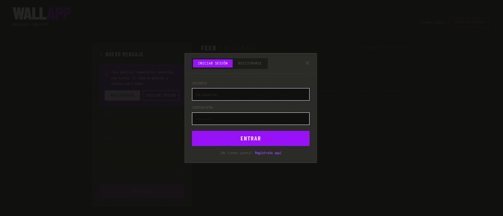
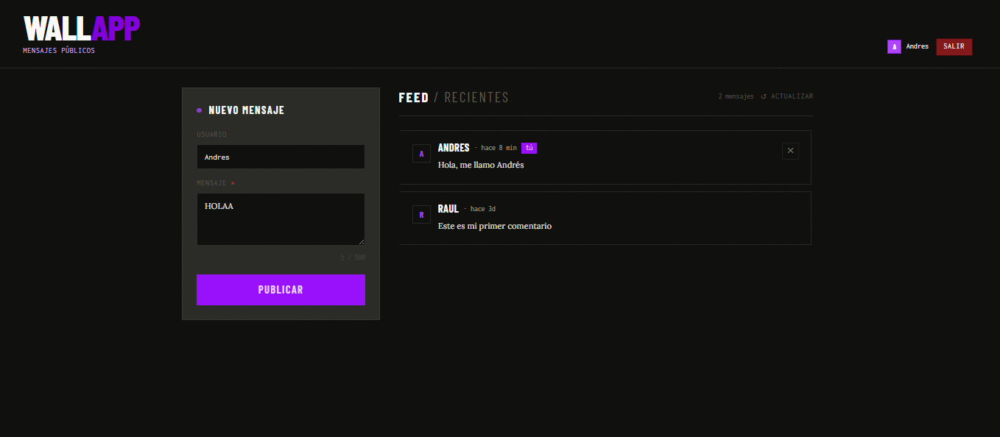

# WALL APP

Interfaz web para consumir la WALLAPP API para poder iniciar sesión y subir comentarios a internet. Construida con HTML, Tailwind CSS v3 y JavaScript modular (ES Modules).

## Página Deployed

- https://wallappfront.netlify.app/

## Screenshots





## Tecnologías

- HTML5
- Tailwind CSS v4.1 (compilado con CLI)
- JavaScript ES Modules (sin bundler)

## Requisitos

- Node.js 18+
- Tailwind CSS CLI instalado

## Desarrollo

Compila Tailwind en modo watch:

```bash
npx tailwindcss -i ./src/input.css -o ./src/output.css --watch
```

Abre `index.html` con Live Server (VSCode) o cualquier servidor local.

## Producción

Compila Tailwind minificado antes de subir:

```bash
npx tailwindcss -i ./src/input.css -o ./src/output.css --minify
```

## Configuración de la API

En `js/config.js`, actualiza `API_BASE` con la URL de tu backend:

```js
// Local
const API_URL = "http://localhost:3001";

// Producción
const API_URL = "https://tu-api.up.railway.app";
```

## Funcionalidades

- Cargar comentarios de todos los usuarios al iniciar (GET)
- Postear comentarios una vez que te hayas logueado (POST)
- Eliminar comentario de tu propiedad (DELETE)
- Minimo de 5 letras un comentario
- Mensaje de NO COMENTARIOS cuando no haya comentarios
- Notificaciones de publicación exitosa o eliminación de comentario
- Textos largos con scroll sin romper el layout
- Login y Registro de usuarios
- Cada usuario registrado y logueado puede comentar y borrar sus propios comentarios
- Todo mundo puede ver los comentarios sin tener que estar logueado

## Deploy en Netlify

1. Compila Tailwind con `--minify`
2. Sube la carpeta `comments-front/` a Netlify via drag & drop o conectando el repo de GitHub
3. Publish directory: `src`
4. Build command: dejar vacío

> Asegúrate de que el backend esté desplegado y que `API_BASE` en `config.js` apunte a la URL pública antes de subir.
